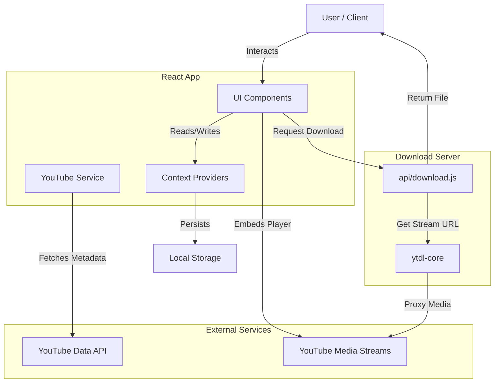
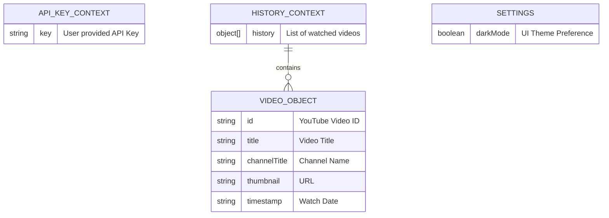

# Streamix 🎥

A modern, ad-free YouTube frontend built with React, Tailwind CSS, and Vite. Features a premium UI, background play, video downloads, and local history management.


## 🚀 Features

- **Ad-Free Experience**: Direct playback using the YouTube IFrame API.
- **Video Downloads**: Download videos in 360p (Combined) or up to 720p/1080p (Stream-dependent).
- **Background Play**: Supports mobile background audio and lock-screen controls via the Media Session API.
- **Responsive Design**: Optimized for Desktop, Tablet, and Mobile (with PWA-like feel).
- **Local History**: Your watch history is stored locally on your device.
- **Custom API Key**: Users provide their own API key for unlimited quota.

---

## 🛠️ Setup & Installation

1.  **Clone the repository**:

    ```bash
    git clone https://github.com/yourusername/streamix.git
    cd streamix
    ```

2.  **Install dependencies**:

    ```bash
    npm install
    ```

3.  **Run the development server**:

    ```bash
    npm run dev
    ```

4.  **Open in Browser**:
    Navigate to `http://localhost:5173`.

---

## 🔑 YouTube data API Key

Streamix requires a YouTube Data API v3 key to fetch video details, search results, and recommendations.

### How to Get an API Key

1.  Go to the [Google Cloud Console](https://console.cloud.google.com/).
2.  Create a new project or select an existing one.
3.  Navigate to **APIs & Services** > **Library**.
4.  Search for **YouTube Data API v3** and enable it.
5.  Go to **Credentials** and click **Create Credentials** > **API Key**.
6.  (Optional but Recommended) Restrict the key to "YouTube Data API v3" to prevent misuse.

### How to Add/Change the Key in Streamix

1.  **First Launch**: The app will automatically prompt you to enter your API Key via a modal.
2.  **Changing the Key**:
    - Open the **Sidebar** (Hamburger menu).
    - Click the **"Change API Key"** (Key icon) button at the bottom.
    - Enter your new key and click Save.

---

## 🏗️ Architecture & Data Flow

Streamix is a client-side React application that communicates directly with the YouTube Data API for metadata and uses a lightweight backend (Express/Vercel) solely for generating download links.

### System Overview



### Entity Relationship (Client-Side State)

Since we treat `localStorage` as our database, here is how data is structured:



---

## 🎮 Controls & Key Bindings

When watching a video, you can use these keyboard shortcuts (similar to YouTube):

| Key                 | Action                  |
| :------------------ | :---------------------- |
| **Space** / **K**   | Play / Pause            |
| **←** (Left Arrow)  | Rewind 5 seconds        |
| **→** (Right Arrow) | Fast Forward 5 seconds  |
| **J**               | Rewind 10 seconds       |
| **L**               | Fast Forward 10 seconds |
| **M**               | Toggle Mute             |
| **F**               | Toggle Fullscreen       |

> **Note**: These controls are disabled when typing in the Search bar.

---

## 💾 Local Storage Usage

Streamix strictly respects user privacy by storing data **only on your device**.

| Key                  | Description                                                               | Data Type  |
| :------------------- | :------------------------------------------------------------------------ | :--------- |
| `streamix-api-key`   | Your personal YouTube Data API key.                                       | String     |
| `streamix-history`   | A list of the last 20 videos you watched. Used for "Recommended" section. | JSON Array |
| `streamix-dark-mode` | Your preference for Light or Dark mode.                                   | Boolean    |

---

## 📱 Mobile features

- **PWA Layout**: Bottom navigation style sidebar on mobile (overlay).
- **Background Play**: Content continues playing when the screen is locked.
- **Lock Screen Controls**: Play/Pause/Seek from your phone's lock screen.
